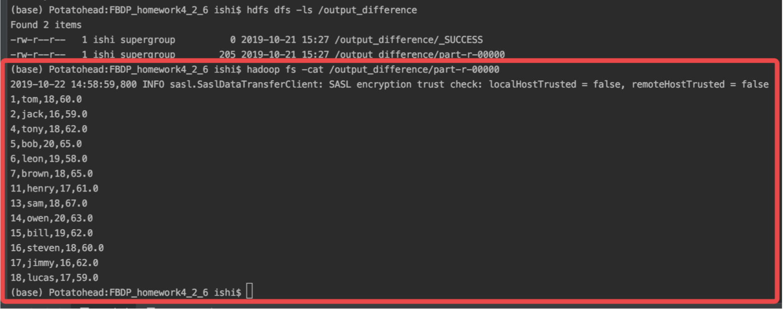

#金融大数据处理技术_作业4

## 171860015-计金-石霭青

本次作业内容为MapReduce基础编程，运行环境为mac os系统+hadoop3.2.1伪分布式+Intellij IDEA。

全部程序伪分布运行完后HDFS文件系统中的输入输出文件目录展示如下。

以下为各题运行截图。

#### 1 给出矩阵乘法的MapReduce实现，以M_3_4和N_4_2作为输入进行测试。

#### 2 给出关系代数的选择、投影、并集、交集、差集及自然连接的MapReduce实现。测试集如下：

* 关系Ra：(id, name, age, weight)
* 关系Rb：(id, gender, height)

##### 2.1 在Ra.txt上选择age=18的记录

#####       在Ra.txt上选择age<18的记录

##### 2.2 在Ra.txt上对属性name进行投影

##### 2.3 求Ra1和Ra2的并集

##### 2.4 求Ra1和Ra2的交集

##### 2.5 求Ra2 - Ra1

##### 2.6 Ra和Rb在属性id上进行自然连接，要求最后的输出格式为(id, name, age, gender, weight, height)

