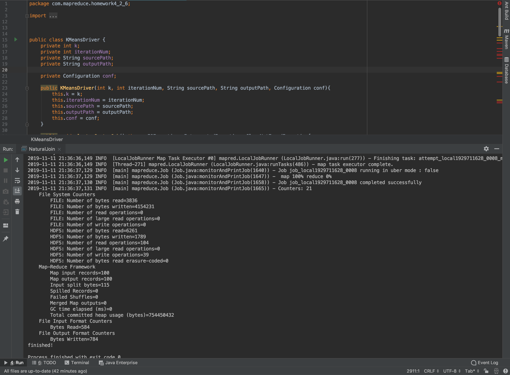
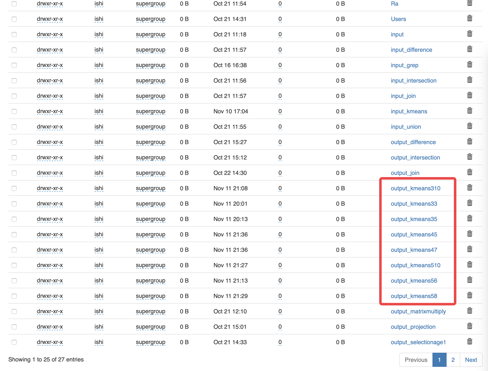

#README

###文件说明

「代码」文件夹中存放KMeans算法MapReduce代码

「聚类结果」文件夹中存放以不同聚类个数与不同迭代次数运行「代码」后所得到的聚类结果，为txt格式。文件名皆为「kAitB.txt」，A代表聚类个数，B代表迭代次数

「可视化聚类结果」文件夹中存放以python matplotlib对「聚类结果」进行可视化的代码与图片，详情请查看md文件「可视化聚类结果(代码+图).md」

以下为代码运行截图与HDFS文件系统中的output文件夹截图

