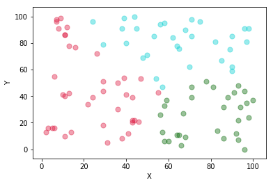
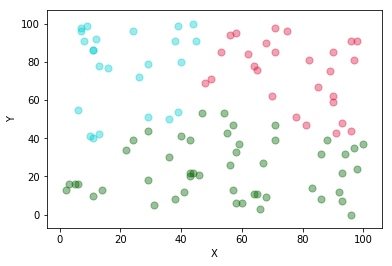
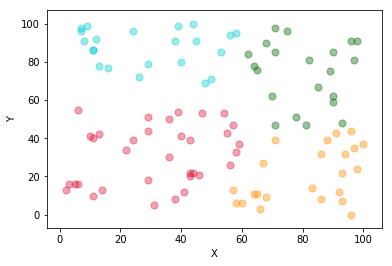
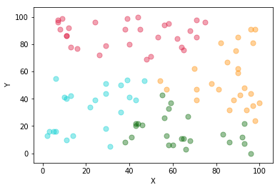
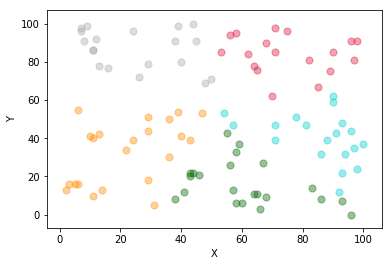
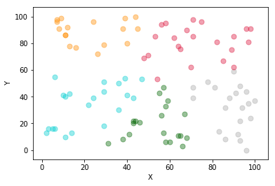
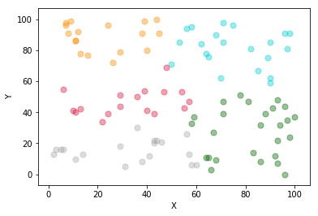

```python
import matplotlib.pyplot as plt
import numpy as np

plt.rcParams['font.sans-serif']=['SimHei']
plt.rcParams['axes.unicode_minus'] = False
```


```python
filename = '/Users/ishi/Desktop/material/学习/大三上/金融大数据处理技术/作业/171860015-石霭青-作业5/results/k3it3.txt'
k = 3

clusters = [[] for i in range(k)]

with open(filename, 'r') as f:
    lines = f.readlines()
    for line in lines:
        clusters[0].append(line[-2])
        line = line[:-3]
        temp = [float(s) for s in line.split(',')]
        clusters[1].append(temp[0])
        clusters[2].append(temp[1])

plt.xlabel('X')
plt.ylabel('Y')
colors = ['#00CED1', '#DC143C', '#006400']
area = np.pi * 4**2

for i in range(len(clusters[0])):
    num = int(clusters[0][i])
    plt.scatter(clusters[1][i], clusters[2][i], s=area, c=colors[num-1], alpha=0.4)

plt.show()
```





```python
filename = '/Users/ishi/Desktop/material/学习/大三上/金融大数据处理技术/作业/171860015-石霭青-作业5/results/k3it5.txt'
k = 3

clusters = [[] for i in range(k)]

with open(filename, 'r') as f:
    lines = f.readlines()
    for line in lines:
        clusters[0].append(line[-2])
        line = line[:-3]
        temp = [float(s) for s in line.split(',')]
        clusters[1].append(temp[0])
        clusters[2].append(temp[1])

plt.xlabel('X')
plt.ylabel('Y')
colors = ['#00CED1', '#DC143C', '#006400', '#FF8C00', '#A9A9A9']
area = np.pi * 4**2

for i in range(len(clusters[0])):
    num = int(clusters[0][i])
    plt.scatter(clusters[1][i], clusters[2][i], s=area, c=colors[num-1], alpha=0.4)

plt.show()
```





```python
filename = '/Users/ishi/Desktop/material/学习/大三上/金融大数据处理技术/作业/171860015-石霭青-作业5/results/k4it5.txt'
k = 4

clusters = [[] for i in range(k)]

with open(filename, 'r') as f:
    lines = f.readlines()
    for line in lines:
        clusters[0].append(line[-2])
        line = line[:-3]
        temp = [float(s) for s in line.split(',')]
        clusters[1].append(temp[0])
        clusters[2].append(temp[1])

plt.xlabel('X')
plt.ylabel('Y')
colors = ['#00CED1', '#DC143C', '#006400', '#FF8C00', '#A9A9A9']
area = np.pi * 4**2

for i in range(len(clusters[0])):
    num = int(clusters[0][i])
    plt.scatter(clusters[1][i], clusters[2][i], s=area, c=colors[num-1], alpha=0.4)

plt.show()
```





```python
filename = '/Users/ishi/Desktop/material/学习/大三上/金融大数据处理技术/作业/171860015-石霭青-作业5/results/k4it7.txt'
k = 4

clusters = [[] for i in range(k)]

with open(filename, 'r') as f:
    lines = f.readlines()
    for line in lines:
        clusters[0].append(line[-2])
        line = line[:-3]
        temp = [float(s) for s in line.split(',')]
        clusters[1].append(temp[0])
        clusters[2].append(temp[1])

plt.xlabel('X')
plt.ylabel('Y')
colors = ['#00CED1', '#DC143C', '#006400', '#FF8C00', '#A9A9A9']
area = np.pi * 4**2

for i in range(len(clusters[0])):
    num = int(clusters[0][i])
    plt.scatter(clusters[1][i], clusters[2][i], s=area, c=colors[num-1], alpha=0.4)

plt.show()
```





```python
filename = '/Users/ishi/Desktop/material/学习/大三上/金融大数据处理技术/作业/171860015-石霭青-作业5/results/k5it6.txt'
k = 5

clusters = [[] for i in range(k)]

with open(filename, 'r') as f:
    lines = f.readlines()
    for line in lines:
        clusters[0].append(line[-2])
        line = line[:-3]
        temp = [float(s) for s in line.split(',')]
        clusters[1].append(temp[0])
        clusters[2].append(temp[1])

plt.xlabel('X')
plt.ylabel('Y')
colors = ['#00CED1', '#DC143C', '#006400', '#FF8C00', '#A9A9A9']
area = np.pi * 4**2

for i in range(len(clusters[0])):
    num = int(clusters[0][i])
    plt.scatter(clusters[1][i], clusters[2][i], s=area, c=colors[num-1], alpha=0.4)

plt.show()
```





```python
filename = '/Users/ishi/Desktop/material/学习/大三上/金融大数据处理技术/作业/171860015-石霭青-作业5/results/k5it8.txt'
k = 5

clusters = [[] for i in range(k)]

with open(filename, 'r') as f:
    lines = f.readlines()
    for line in lines:
        clusters[0].append(line[-2])
        line = line[:-3]
        temp = [float(s) for s in line.split(',')]
        clusters[1].append(temp[0])
        clusters[2].append(temp[1])

plt.xlabel('X')
plt.ylabel('Y')
colors = ['#00CED1', '#DC143C', '#006400', '#FF8C00', '#A9A9A9']
area = np.pi * 4**2

for i in range(len(clusters[0])):
    num = int(clusters[0][i])
    plt.scatter(clusters[1][i], clusters[2][i], s=area, c=colors[num-1], alpha=0.4)

plt.show()
```





```python
filename = '/Users/ishi/Desktop/material/学习/大三上/金融大数据处理技术/作业/171860015-石霭青-作业5/results/k5it10.txt'
k = 5

clusters = [[] for i in range(k)]

with open(filename, 'r') as f:
    lines = f.readlines()
    for line in lines:
        clusters[0].append(line[-2])
        line = line[:-3]
        temp = [float(s) for s in line.split(',')]
        clusters[1].append(temp[0])
        clusters[2].append(temp[1])

plt.xlabel('X')
plt.ylabel('Y')
colors = ['#00CED1', '#DC143C', '#006400', '#FF8C00', '#A9A9A9']
area = np.pi * 4**2

for i in range(len(clusters[0])):
    num = int(clusters[0][i])
    plt.scatter(clusters[1][i], clusters[2][i], s=area, c=colors[num-1], alpha=0.4)

plt.show()
```



