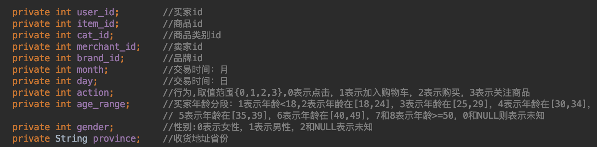
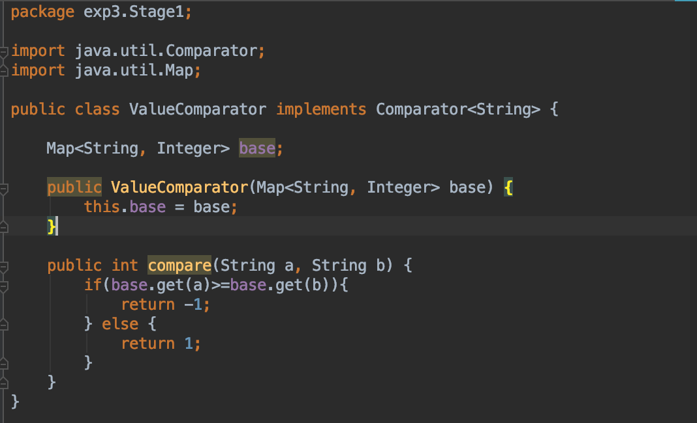
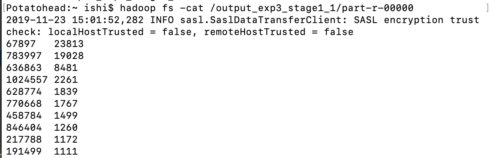
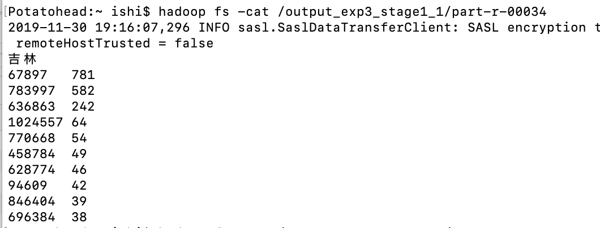
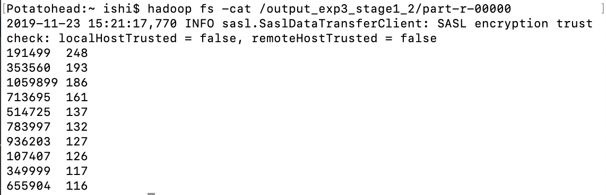
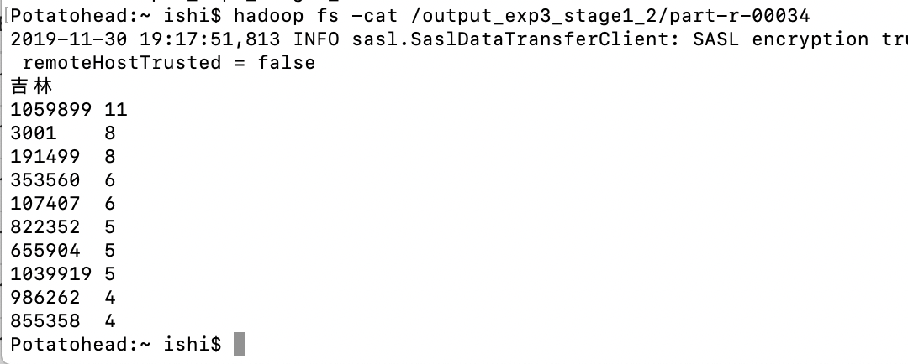

# 金融大数据处理技术-实验3-阶段一

## 171860015-计金-石霭青

* 使用数据为精简数据集：淘宝双十一用户购物数据集（100万条），见附件 million_user_log.csv.zip
* 基于精简数据集完成MapReduce作业：
  1 统计各省的双十一前十热门关注产品（“点击+添加购物车+购买+关注”总量最多前10的产品）
  2 统计各省的双十一前十热门销售产品（购买最多前10的产品）
* 代码请查看`myFBDP2019/171860015-石霭青-实验3/FBDP_exp3/exp3(code)/`路径中的Stage1包和User.java。

### 0 定义用户行为类和Map的比较类

* 在project中定义一个用户行为类User，包含以下数据：

以及相应的User构造方法、数据设定方法与读取方法等。

* 在project中定义一个map的ValueComparator，用于未来使用treemap进行前十筛选时使用value进行排序，而不是treemap默认的key排序

  

### 1 统计各省的双十一前十热门关注产品（“点击+添加购物车+购买+关注”总量最多前10的产品）

在Stage1类中，定义了Stage11Mapper类和Stage1Reducer类作为本问题的mapper和reducer。

在Stage11Mapper类中，对于csv文件读入的每行数据先进行了空判断，然后将其转化为一个User对象，输出这个User的province作为key，item_id作为value，以在reducer中以省为划分进行数据统计。

在Stage1Reducer类中，定义了一个TreeMap用于统计商品id及其销量。reduce方法负责遍历values（item_id），对于首次出现的item_id，将其存入treemap，key为item_id，value为1；对于不是首次出现的，其value加1。重写的cleanup方法负责先对treemap进行以value从大到小排序，然后将TreeMap中的前十个商品及其关注度（即前十热门关注产品）取出并输出作为该省的mapreduce结果。

hdfs文件系统中创建的本次程序输出文件夹目录如下：

每个省的结果都被输出到了一个单独的文件中。

读取其中一个文件（以吉林为例），结果截图如下（第一列为item_id，第二列为该商品关注度）：

### 2 统计各省的双十一前十热门销售产品（购买最多前10的产品）

与1的差别在于，mapper类的写法不同。在Stage1类中，定义了Stage12Mapper类作为本问题的mapper，reducer与1中一致。

在Stage12Mapper类中，增加了对于买家行为的判断，只输出行为为“2”购买的买家行为。

hdfs文件系统中创建的本次程序输出文件夹目录如下：

读取其中一个文件（以吉林为例），结果截图如下（第一列为item_id，第二列为该商品销售量）：

