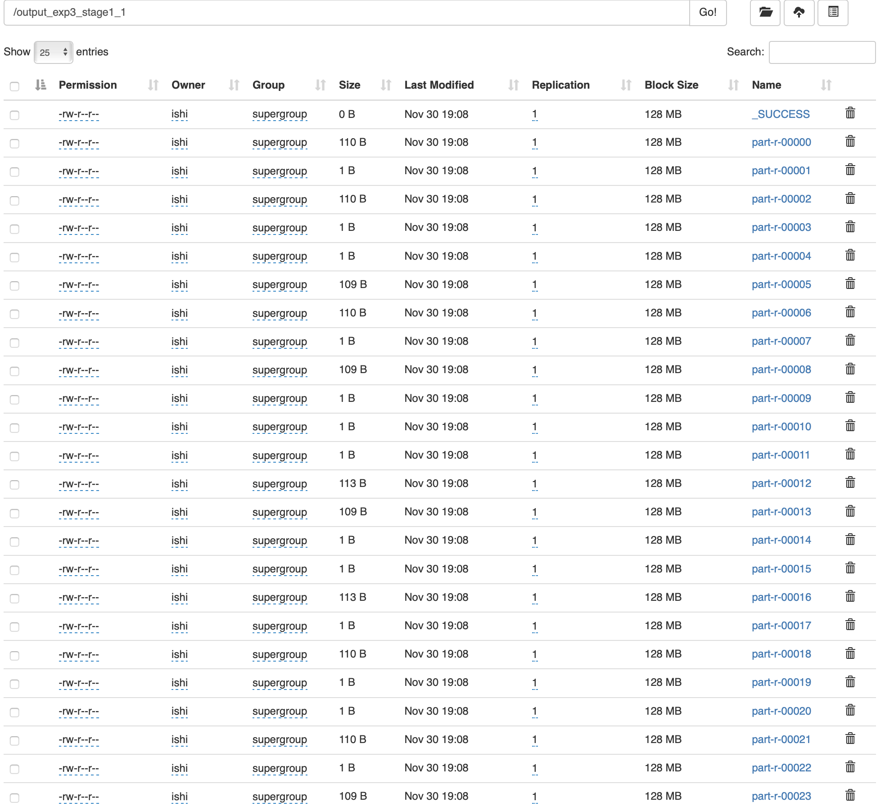
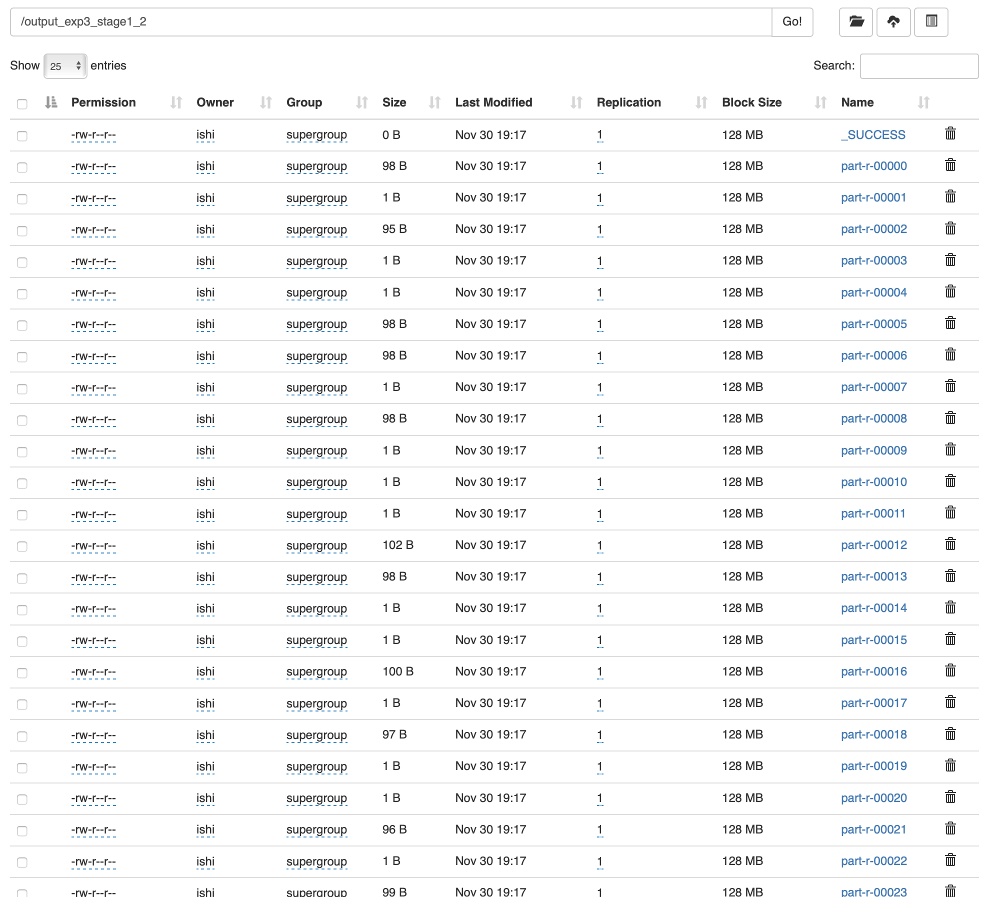

# 金融大数据处理技术-实验3-阶段一

## 171860015-计金-石霭青

* 使用数据为精简数据集：淘宝双十一用户购物数据集（100万条），见附件 million_user_log.csv.zip
* 基于精简数据集完成MapReduce作业：
  1 统计各省的双十一前十热门关注产品（“点击+添加购物车+购买+关注”总量最多前10的产品）
  2 统计各省的双十一前十热门销售产品（购买最多前10的产品）

### 0 定义用户行为类

在project中定义一个用户行为类User，包含以下数据：

以及相应的User构造方法、数据设定方法与读取方法等。

### 1 统计各省的双十一前十热门关注产品（“点击+添加购物车+购买+关注”总量最多前10的产品）

在Stage1类中，定义了Stage11Mapper类和Stage11Reducer类作为本问题的mapper和reducer。

在Stage11Mapper类中，对于csv文件读入的每行数据先进行了空判断，然后将其转化为一个User对象，输出这个User的item_id作为key，1作为value。

在Stage11Reducer类中，定义了一个TreeMap用于统计前十热度的商品。reduce方法负责将输入的key（item_id）相应的values加起来，作为这个商品的总关注度，然后将item_id和相应关注度存入TreeMap中。重写的cleanup方法负责将TreeMap中的前十个商品及其关注度（即前十热门关注产品）取出并输出作为mapreduce结果。

结果截图如下：

### 2 统计各省的双十一前十热门销售产品（购买最多前10的产品）

与1的差别在于，mapper类的写法不同。在Stage1类中，定义了Stage12Mapper类作为本问题的mapper，reducer与1中一致。

在Stage12Mapper类中，增加了对于买家行为的判断，只输出行为为“2”购买的买家行为。

结果截图如下：

