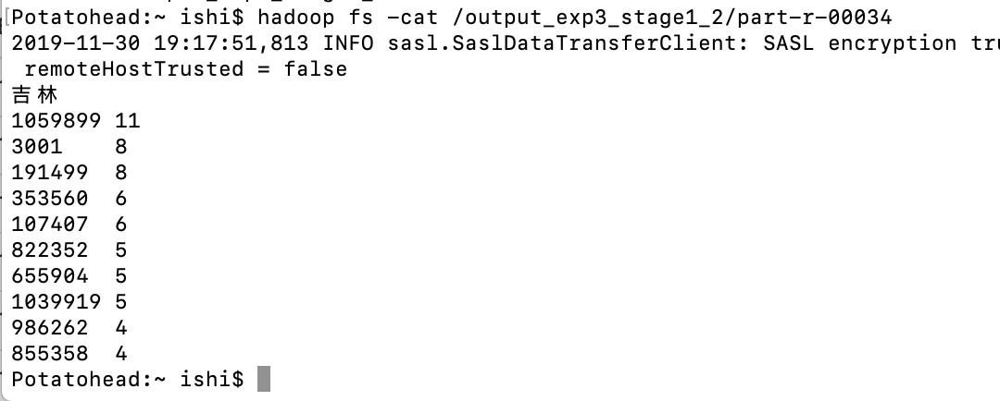
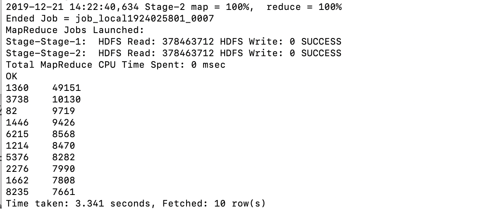

# 金融大数据处理技术-实验3-阶段三

#### 171860015-计金-石霭青

## 1 Spark的安装

操作系统：macOS

* 通过homebrew下载Spark

  `brew install apache-spark`

* 配置环境变量

  `vim ~/.bash_profile`

  ```bash
  export SPARK_PATH="/usr/local/Cellar/apache-spark/2.4.4"
  export PATH="$SPARK_PATH/bin:$PATH"
  ```

* 激活环境变量

  `source ~/.bash_profile`

* 验证spark是否配置成功

  `spark-shell`

  

  `sbin/start-all.sh`

  

  jps看到Master和Worker。

  Spark配置完成。

* Spark基础API测试

  ```scala
  scala> val testFile = sc.textFile("file:///usr/local/Cellar/apache-spark/2.4.4/README.md")
  testFile: org.apache.spark.rdd.RDD[String] = file:///usr/local/Cellar/apache-spark/2.4.4/README.md MapPartitionsRDD[1] at textFile at <console>:24
  
  scala> testFile.count()
  res1: Long = 105
  
  scala> testFile.first()
  res2: String = # Apache Spark
  
  scala> import java.lang.Math
  import java.lang.Math
  
  scala> testFile.map(line => line.split(" ").size).reduce((a,b) => Math.max(a,b))
  res3: Int = 22
  ```

  WordCount MapReduce的Spark实现

  ```scala
  scala> val wordCount = testFile.flatMap(line => line.split(" ")).map(word => (word,1)).reduceByKey((a,b) => a+b) 
  wordCount: org.apache.spark.rdd.RDD[(String, Int)] = ShuffledRDD[5] at reduceByKey at <console>:26
  
  scala> wordCount.collect()
  res5: Array[(String, Int)] = Array((package,1), (this,1), (integration,1), (Python,2), (page](http://spark.apache.org/documentation.html).,1), (cluster.,1), (its,1), ([run,1), (There,1), (general,3), (have,1), (pre-built,1), (Because,1), (YARN,,1), (locally,2), (changed,1), (locally.,1), (sc.parallelize(1,1), (only,1), (several,1), (This,2), (basic,1), (Configuration,1), (learning,,1), (documentation,3), (first,1), (graph,1), (Hive,2), (info,1), (["Specifying,1), ("yarn",1), ([params]`.,1), ([project,1), (prefer,1), (SparkPi,2), (<http://spark.apache.org/>,1), (engine,1), (version,1), (file,1), (documentation,,1), (MASTER,1), (example,3), (["Parallel,1), (are,1), (params,1), (scala>,1), (DataFrames,,1), (provides,1), (refer,2), (configure,1), (Interactive,2), (R,,1), (can,7), (build,4),...
  ```


## 2 基于IDEA和maven的Spark开发环境搭建

### 2.1 scala插件安装

在IDEA的Configure-Plugins中搜索scala并下载该插件，下载完成后重启IDEA。

### 2.2 在IDEA中创建Spark项目

* 新建maven项目。在project-structure的Global Libraries中引入scala-sdk

* 在main下新建名为scala的文件夹，并将其mark as Sources
* 修改pom.xml文件，引入scala、spark相关依赖

* 在scala文件夹下新建scala object，即可开始scala语言的spark编程


## 3 实验3 阶段三

```
阶段三任务（Spark编程）：
基于精简数据集完成Spark作业：
- 统计各省销售最好的产品类别前十（销售最多前10的产品类别）
- 统计各省的双十一前十热门销售产品（购买最多前10的产品）-- 和MapReduce作业对比结果
- 查询双11那天浏览次数前十的品牌 -- 和Hive作业对比结果
```

### 3.1 统计各省销售最好的产品类别前十（销售最多前10的产品类别）

思路：按行读入数据集后，将每行用","分割并存成"((province, cat_id, action), 1)"键值对，value为1意味着这条记录涉及到的商品数目为1。对处理后的RDD先经过filter筛选顾客行为为“购买”的产品类别，然后使用reduceByKey将同一省份同一产品类别的销售数目求和，再将其按省取前十。

核心代码：

```scala
val sum_groupbyprovince1 = lines.map(line => {
      val info =line.split(",")
      ((info(10),info(2), info(7)),1)
    }).filter(record => record._1._3 == "2").reduceByKey(_+_).groupBy(_._1._1).map(
      test => {
        val province = test._1

        val top10 = test._2.toList.sortBy(_._2)(Ordering.Int.reverse).take(10).
          map(item => item._1._2+"  "+item._2)

        (province, top10)
      }
    )
```

打印统计结果：


### 3.2 统计各省的双十一前十热门销售产品(购买最多前10的产品)--和MapReduce作业对比结果

思路：按行读入数据集后，将每行用","分割并存成"((province, item_id, action), 1)"键值对，value为1意味着这条记录涉及到的商品数目为1。对处理后的RDD先经过filter筛选顾客行为为“购买”的产品，然后使用reduceByKey将同一省份同一商品的销售数目求和，再将其按省取前十。

核心代码：

```scala
val sum_groupbyprovince2 = lines.map(line => {
      val info =line.split(",")
      ((info(10),info(1), info(7)),1)
    }).filter(record => record._1._3 == "2").reduceByKey(_+_).groupBy(_._1._1).map(
      test => {
        val province = test._1

        val top10 = test._2.toList.sortBy(_._2)(Ordering.Int.reverse).take(10).
          map(item => item._1._2+"  "+item._2)

        (province, top10)
      }
    )
```

打印统计结果：


将其与阶段一结果对比(以吉林省结果为例)，阶段一结果截图如下：



可见结果一致。

### 3.3 查询双11那天浏览次数前十的品牌 -- 和Hive作业对比结果

思路：浏览行为相当于点击行为，action=1。按行读入数据集后，将每行用","分割并存成"((brand_id, action), 1)"键值对，value为1意味着这条记录涉及到的品牌数目为1。对处理后的RDD先经过filter筛选顾客行为为“点击”的产品，然后使用reduceByKey将同一品牌的点击次数求和，再将其取前十。

核心代码：

```scala
val count_click = lines.map(
      line => {
        val info = line.split(",")
        ((info(4),info(7)),1)
      }
    ).filter(record => record._1._2 == "0").reduceByKey(_+_).
      sortBy(_._2, false).take(10)
```

打印统计结果：


将其与阶段二结果对比，阶段二结果截图如下：



可见结果一致。