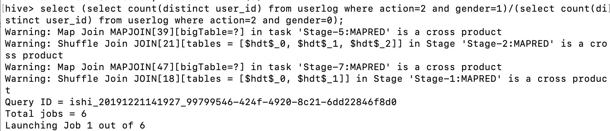
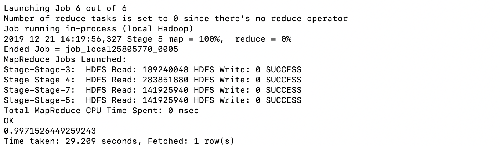

# 金融大数据处理技术-实验3-阶段二

## 171860015-计金-石霭青

### 1 Mac系统中Hive安装与配置

#### 1.1 安装

`brew install hive`

#### 1.2 元数据库配置

1. 登陆mysql：`mysql -u root`
2. 创建数据库：`create database metastore;`
3. 创建新的用户：`create user 'hive'@'localhost' identified by '123456';`
4. 修改用户权限：`grant select,insert,update,delete,alter,create,index,references on metastore.* to 'hive'@'localhost';`
5. 刷新权限：`flush privileges;`

#### 1.3 配置Hive

1. 在hive安装目录下的conf/创建hive-site.xml文件

   ```xml
   <?xml version="1.0" encoding="UTF-8" standalone="no"?>
   <?xml-stylesheet type="text/xsl" href="configuration.xsl"?>
   <configuration>
   
   <property>
            <name>hive.metastore.uris</name>
            <value>thrift://127.0.0.1:9083</value>
            <description>Thrift URI for the remote metastore. Used by metastore client to connect to remote metastore.</description>
   </property>
   <property>
          <name>javax.jdo.option.ConnectionURL</name>
          <value>jdbc:mysql://localhost:3306/metastore?createDatabaseIfNotExist=true&amp;useUnicode=true&amp;characterEncoding=latin1&amp;useSSL=true</value>
          <description>JDBC connect string for a JDBC metastore</description>
   </property>
   <property>
           <name>javax.jdo.option.ConnectionDriverName</name>
           <value>com.mysql.jdbc.Driver</value>
           <description>Driver class name for a JDBC metastore</description>
   </property>
   <property>
           <name>javax.jdo.option.ConnectionUserName</name>
           <value>hive</value>
           <description>username to use against metastore database</description>
   </property>
   <property>
           <name>javax.jdo.option.ConnectionPassword</name>
           <value>123456</value>
           <description>password to use against metastore database</description>
   </property>
   <property>
           <name>hive.exec.scratchdir</name>
           <value>hdfs://localhost:9000/user/hive/tmp</value>
           <description>HDFS root scratch dir for Hive jobs which gets created with write all (733) permission. For each connecting user, an HDFS scratch dir: ${hive.exec.scratchdir}/&lt;username&gt; is created, with ${hive.scratch.dir.permission}.</description>
     </property>
   <property>
       <name>hive.exec.local.scratchdir</name>
       <value>/tmp/hive/tmp</value>
       <description>Local scratch space for Hive jobs</description>
     </property>
   <property>
          <name>hive.metastore.warehouse.dir</name>
          <value>hdfs://localhost:9000/user/hive/warehouse</value>
          <description>location of default database for the warehouse</description>
   </property>
   <property>
   <name>hive.downloaded.resources.dir</name>
           <value>/tmp/hive/resources</value>
           <description>Temporary local directory for added resources in the remote file system.</description>
   </property>
   <property>
            <name>hive.querylog.location</name>
            <value>/usr/local/hive/log</value>
            <description>Location of Hive run time structured log file</description>
   </property>
   <property>
            <name>hive.server2.logging.operation.log.location</name>
            <value>/usr/local/hive/operation_logs</value>
            <description>Top level directory where operation logs are stored if logging functionality is enabled</description>
   </property>
   
   </configuration>
   ```

2. 在hadoop安装目录下修改core-site.xml文件，添加如下配置

   ```xml
   <property>
           <name>hadoop.proxyuser.zj-db0972.groups</name>
           <value>*</value>
    </property>
    <property>
           <name>hadoop.proxyuser.zj-db0972.hosts</name>
           <value>*</value>
    </property>
   ```

3. 配置Hive日志目录，在Hive的conf下（依个人版本而异）

   `cp hive-log4j2.properties.template hive-log4j2.properties`

   `vim hive-log4j2.properties `

   写入`hive.log.dir=/usr/local/hive/log`

4. 下载mysql-connector（版本8以上）拷贝到lib目录下

   注意一定要下载版本8以上的connector，版本过低会产生`Unknown system variable 'query_cache_size'`问题

   `curl -L 'http://www.mysql.com/get/Downloads/Connector-J/mysql-connector-java-8.0.16.tar.gz/from/http://mysql.he.net/’; | tar xz`

   `cp mysql-connector-java-8.0.16/mysql-connector-java-8.0.16.jar /usr/local/Cellar/hive/3.1.2/libexec/lib/`

#### 1.4 初始化元数据库

1. 初始化metastore库：`schematool -initSchema -dbType mysql`

   初始化成功后可以在metastore库中看到hive创建的如下表

   

#### 1.5 启动Hive

`hive`

#### 1.6 踩坑纪实

1. hadoop的lib中jar包版本与hive的lib中的jar包版本可能产生冲突，如guava.jar。发生这类问题时，将低版本删除，高版本拷贝同步即可。
2. 应下载使用版本8以上的connector，版本过低会产生`Unknown system variable 'query_cache_size'`问题

### 2 阶段二任务

#### 2.1 把精简数据集导入到数据仓库Hive中

1. 创建表userlog，设定字段以","分割

```sql
hive> create table Userlog(user_id int, item_id int, cat_id int, merchant_id int, brand_id int, month int, day int, action int,
    > age_range int, gender int, province string)row format delimited fields terminated by ',' ;
```

2. 将csv文件导入userlog

```sql
hive> load data local inpath '/Users/ishi/Desktop/material/学习/大三上/金融大数据处理技术/作业/171860015-石霭青-实验3/million_user_log.csv 
    > ' overwrite into table userlog;
```

3. 查看表内前100条数据

```sql
hive> select * from userlog limit 100;
```


#### 2.2 数据清洗

通过查看数据，发现数据存在异常。如下图查询user_id为328862并且item_id为406349的所有user_log，发现同一user_id的买家行为存在不同的年龄段和性别情况。


因此先对数据进行异常清洗。

1. 建立一个临时表，保存user_id，该user_id所有记录的不同gender数目，该user_id所有记录的不同age_range数目

```sql
hive> create table tmp1 as select user_id, count(distinct gender) as gender_count, count(distinct age_range) as age_count
    > from userlog group by user_id;
```

2. 建立cleaned_userlog，其中的买家行为的user_log所具有的性别和年龄段都是唯一的（非异常数据）。

```sql
hive> create table cleaned_userlog as select * from userlog
    > where user_id in (select user_id from tmp1 where (gender_count=1 and age_count=1));
```

这个cleaned_userlog就是清洗后的表。查看其字段与行数如下图：


####2.3 查询双11那天有多少人购买了商品

选择action为2的不同（distinct）user_id的购买者，并对他们进行count计数，得到结果为：双11那天购买商品的人数=1196。

由于要统计“人”而非“人次”，因此要加上distinct限制。

`hive> select count(distinct user_id) from cleaned_userlog where action=2;`


####2.4 查询双11那天男女买家购买商品的比例

查询双11当天购买商品的男女买家的比例。

`hive> select (select count(distinct user_id) from cleaned_userlog where action=2 and gender=1)/(select count(distinct user_id) from cleaned_userlog where action=2 and gender=0);`



结果如下，男性买家数目/女性买家数目=0.985。



####2.5 查询双11那天浏览次数前十的品牌

浏览行为相当于点击行为，action=1。

```sql
hive> with tmp1 as (select brand_id, action from cleaned_userlog where action=0)
    > select brand_id, count(action) as browser_count from tmp1 group by brand_id order by browser_count desc
    > limit 10;
```

结果如下，第一列为brand_id，第二列为浏览次数

