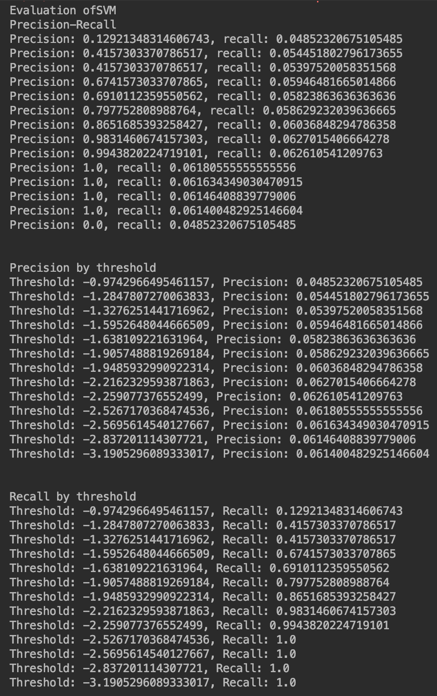
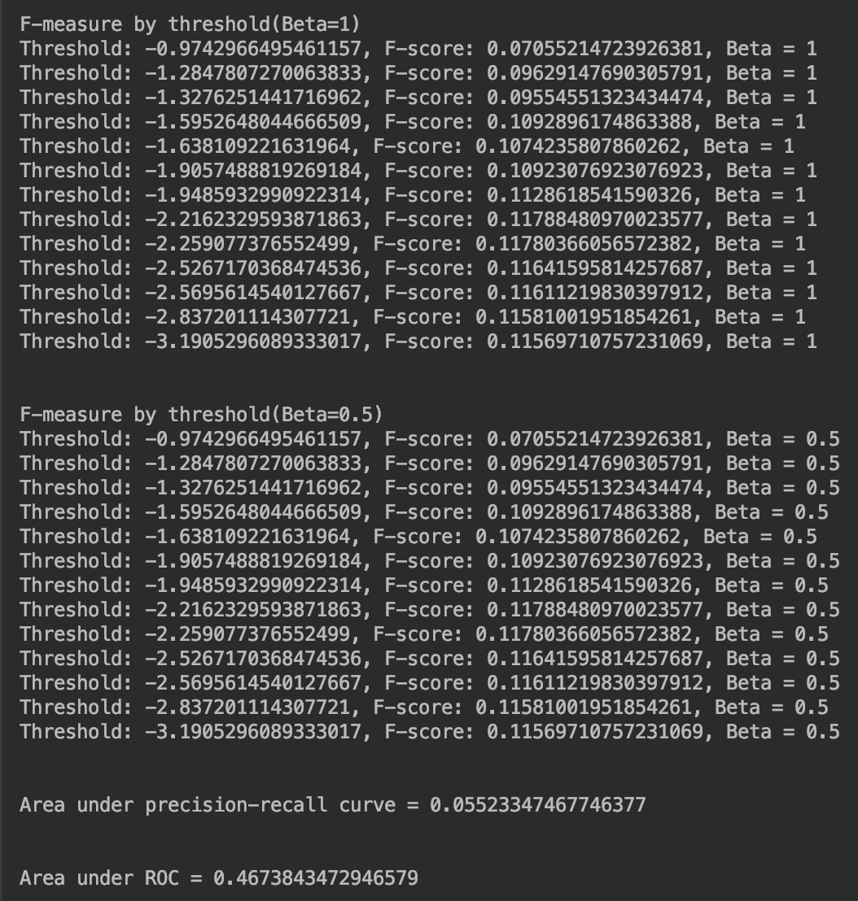
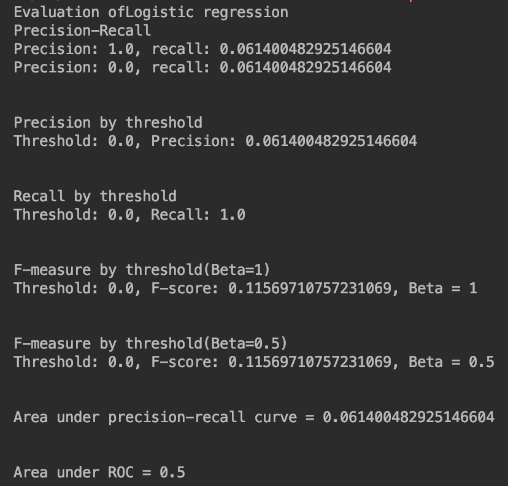
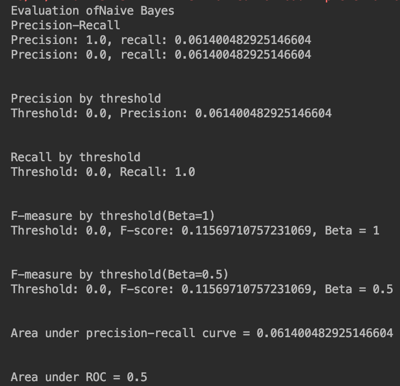
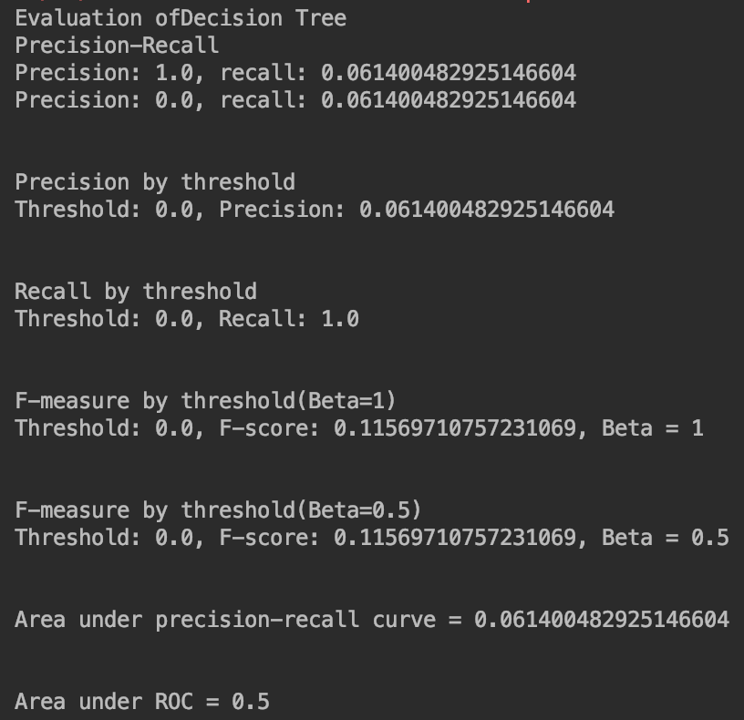
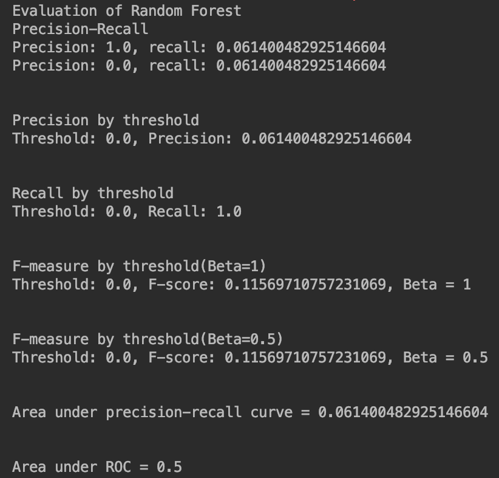
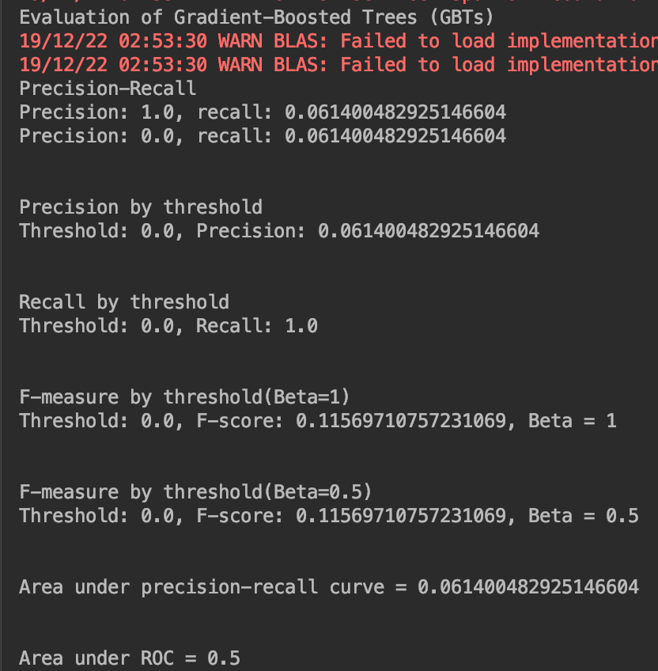

# 金融大数据处理技术-实验3-阶段四

#### 171860015-计金-石霭青

```
回头客训练集train.csv和回头客测试集test.csv，训练集和测试集拥有相同的字段，字段定义如下：
user_id | 买家id 
age_range | 买家年龄分段：1表示年龄<18,2表示年龄在[18,24]，3表示年龄在[25,29]，4表示年龄在[30,34]，5表示年龄在[35,39]，6表示年龄在[40,49]，7和8表示年龄>=50，0和NULL则表示未知 
gender | 性别:0表示女性，1表示男性，2和NULL表示未知 
merchant_id | 商家id 
label | 是否是回头客，0值表示不是回头客，1值表示回头客，-1值表示该用户已经超出我们所需要考虑的预测范围。NULL值只存在测试集，在测试集中表示需要预测的值。

阶段四任务（数据挖掘）：
针对预处理后的训练集和测试集，基于MapReduce或Spark MLlib编写程序预测回头客
评估预测准确率（可选）
```

### 1 数据处理

#### 1.1 从hdfs读取数据

```scala
val conf = new SparkConf().setAppName("exp3_stage4").setMaster("local")
val sc = new SparkContext(conf)
val spark = new SQLContext(sc)
import spark.implicits._
// Load training data.
val train_lines = sc.textFile("hdfs://localhost:9000/input_exp3/train_after.csv")
```

#### 1.2 处理label、features

```scala
val data = train_lines.map{ line =>
      val info = line.split(",")
      val label = info(4).toInt
      val features = Vectors.dense(info.slice(1, 3).map(_.toDouble))
      LabeledPoint(label, features)
    }
```

#### 1.3 划分训练集与测试集

```scala
val splits = data.randomSplit(Array(0.7, 0.3), seed = 11L)
val training = splits(0).cache()
val test = splits(1)
```


### 2 模型训练与结果评价

该问题为一个二分类问题，选取了

#### 2.0 自定义模型训练结果评价函数

接收参数为：BinaryClassificationMetrics，即二分类模型在测试集上的预测结果；alName，算法名。

函数代码如下：

```scala
def evaluating(metrics: BinaryClassificationMetrics, alName: String): Unit={

    println("Evaluation of"+alName)
    // 输出各评估指标
    // Precision-Recall Curve
    val PRC = metrics.pr
    println("Precision-Recall")
    PRC.foreach{case(p, r)=>
      println(s"Precision: $p, recall: $r")
    }
    println("\n")

    // Precision by threshold
    val precision = metrics.precisionByThreshold
    println("Precision by threshold")
    precision.foreach{case(t, p)=>
      println(s"Threshold: $t, Precision: $p")
    }
    println("\n")

    // Recall by threshold
    val recall = metrics.recallByThreshold
    println("Recall by threshold")
    recall.foreach{case(t, r)=>
      println(s"Threshold: $t, Recall: $r")
    }
    println("\n")

    // F-measure
    val f1Score = metrics.fMeasureByThreshold
    println("F-measure by threshold(Beta=1)")
    f1Score.foreach{case(t, f)=>
      println(s"Threshold: $t, F-score: $f, Beta = 1")
    }
    println("\n")

    val beta = 0.5
    val fScore = metrics.fMeasureByThreshold(beta)
    println("F-measure by threshold(Beta=0.5)")
    f1Score.foreach{case(t, f)=>
      println(s"Threshold: $t, F-score: $f, Beta = 0.5")
    }
    println("\n")

    // AUPRC
    val auPRC = metrics.areaUnderPR
    println("Area under precision-recall curve = "+ auPRC)
    println("\n")

    // Compute thresholds used in ROC and PR curves
    val thresholds = precision.map(_._1)

    // ROC Curve
    val roc = metrics.roc

    // AUROC
    val auROC = metrics.areaUnderROC
    println("Area under ROC = "+ auROC)
  }
```

评价指标解读：

- 精准度（Precision）：TP/(TP+FP)，真正的正样本在分类器分出的正样本中的比例。
- 召回率（Recall）：TP/(TP+FN)，样本中正例被正确分类的比例。
- F-measure：综合考虑precision和recall，$F_\beta =\frac{(\beta^2+1)PR}{\beta^2P+R}$。$F_\beta$的物理意义就是将准确率和召回率这两个分值合并为一个分值，在合并的过程中，召回率的权重是准确率的$\beta$倍。
- ROC：样本经过分类器后，可以得到样本的预测值，以这些预测值为阈值，就可以得到这些预测值对应的的混淆矩阵，每个混淆矩阵都可以计算(FPR, TPR)点对，将这些点对绘制在二维坐标系中，然后连起来就得到ROC曲线。
- AUC：ROC曲线下的面积。

#### 2.1 SVM

支持向量机，支持稀疏向量。

```scala
val numIterations = 100
val model = SVMWithSGD.train(training, numIterations)
model.clearThreshold()

val scoreAndLabels = test.map { point =>
  val score = model.predict(point.features)
  (score, point.label)
}

val metrics = new BinaryClassificationMetrics(scoreAndLabels)

evaluating(metrics, "SVM")
```

模型评价如下：



#### 2.2 Logistic regression

```scala
val model = new LogisticRegressionWithLBFGS().setNumClasses(10).run(training)
model.clearThreshold()

val scoreAndLabels = test.map { point =>
  val score = model.predict(point.features)
  (score, point.label)
}

val metrics = new BinaryClassificationMetrics(scoreAndLabels)

evaluating(metrics, "Logistic regression")
```

模型评价如下：



#### 2.3 Naive Bayes

```scala
val model = NaiveBayes.train(training, lambda = 1.0, modelType = "multinomial")
val scoreAndLabels = test.map { point =>
      val score = model.predict(point.features)
      (score, point.label)
    }
val metrics = new BinaryClassificationMetrics(scoreAndLabels)

evaluating(metrics, "Naive Bayes")
```

模型评价如下：



#### 2.4 Decision Tree

```scala
val numClasses = 2
val categoricalFeaturesInfo = Map[Int, Int]()
val impurity = "gini"
val maxDepth = 5
val maxBins = 32
val model = DecisionTree.trainClassifier(training, numClasses, categoricalFeaturesInfo,impurity, maxDepth, maxBins)
```

模型评价如下：



#### 2.5 Random Forest

```scala
val numClasses = 2
val categoricalFeaturesInfo = Map[Int, Int]()
val numTrees = 3 // Use more in practice.
val featureSubsetStrategy = "auto" // Let the algorithm choose.
val impurity = "gini"
val maxDepth = 4
val maxBins = 32
val model = RandomForest.trainClassifier(training, numClasses, categoricalFeaturesInfo,
numTrees, featureSubsetStrategy, impurity, maxDepth, maxBins)

val scoreAndLabels = test.map { point =>
  val score = model.predict(point.features)
  (score, point.label)
}
val metrics = new BinaryClassificationMetrics(scoreAndLabels)
evaluating(metrics, "Random Forest")
```

模型评价如下：



#### 2.6 Gradient-Boosted Trees (GBTs)

```scala
val boostingStrategy = BoostingStrategy.defaultParams("Classification")
boostingStrategy.numIterations = 3 // Note: Use more iterations in practice.
boostingStrategy.treeStrategy.numClasses = 2
boostingStrategy.treeStrategy.maxDepth = 5
boostingStrategy.treeStrategy.categoricalFeaturesInfo = Map[Int, Int]()
val model = GradientBoostedTrees.train(training, boostingStrategy)

val scoreAndLabels = test.map { point =>
  val score = model.predict(point.features)
  (score, point.label)
}
val metrics = new BinaryClassificationMetrics(scoreAndLabels)
evaluating(metrics, "Gradient-Boosted Trees (GBTs)")
```

模型评价如下：



