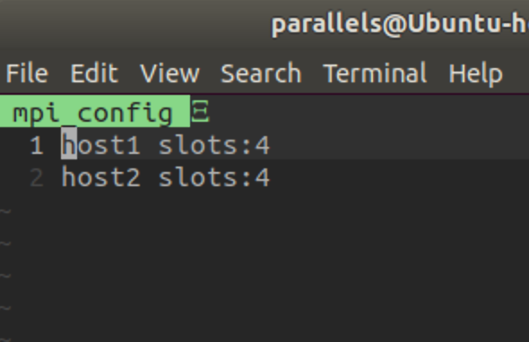
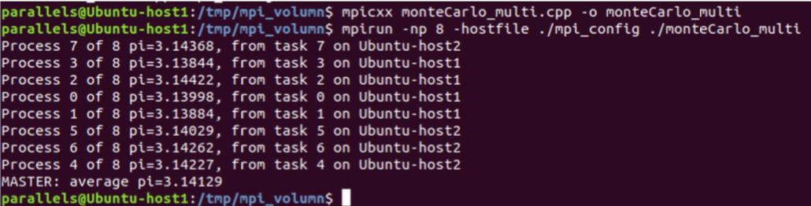

# 实验1 MPI Programming

## 1 准备

### 1.1 Ubuntu虚拟机安装

在macos下使用了parallels desktop管理虚拟机，安装的是Ubuntu18.04，此步骤略

### 1.2 安装MPI编译和运行环境：OpenMPI

`sudo apt-get install libopenmpi-dev`

(至此单机mpi就能编译运行啦)

## 2 两个节点OpenMPI集群的搭建和使用

### 2.1 准备host文件

在两个节点的/etc/hosts文件中添加两个节点的IP映射

`sudo vim /etc/hosts`

### 2.2 检查节点之间的网络连接

host1和host2 ping彼此

### 2.3 两个节点安装sshd

`sudo apt-get install openssh-server`

### 2.4 host1通过ssh免密登录host2

* host1生成公钥私钥对

  `ssh-keygen`

* host1复制自己的公钥到host2

  `ssh-copy-id -i ~/.ssh/id_rsa.pub host2`

* 测试host1免密登录host2

  `ssh 'host2'`

  

## 3 两个节点通过NFS共享目录

### 3.1 创建相同路径

host1和host2节点都在相同的路径下创建一个共享文件夹。

`mkdir /tmp/mpi_volumn`（两个节点操作相同）

### 3.2 安装NFS

host1和host2节点都安装nfs-kernel-server

`sudo apt install nfs-kernel-server`

### 3.3 host1设置共享目录权限

* host1节点设置共享文件夹为读写权限

* 进入配置文件/etc/exports`sudo vim /etc/exports`

  

* 重启nfs服务`sudo /etc/init.d/nfs-kernel-server restart`

### 3.4 host2节点加载共享目录

`sudo mount -t nfs 10.211.55.4:/tmp/mpi_volumn /tmp/mpi_volumn`

## 4 MPI集群测试

* 测试程序：monteCarlo_multi.cpp
* 编译：`mpicxx monteCarlo_multi.cpp -o monteCarlo_multi`

* 进程分配文件：mpi_config

  

* 运行：`mpirun -np 8 -hostfile ./mpi_config ./monteCarlo_multi`

* 结果：

